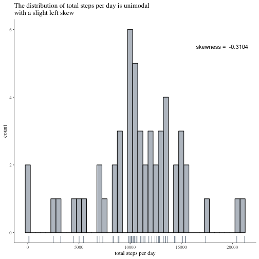
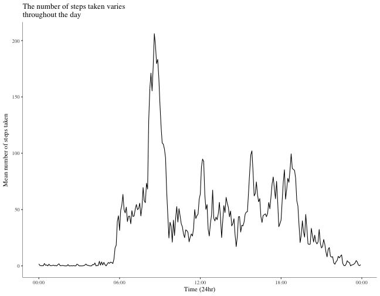
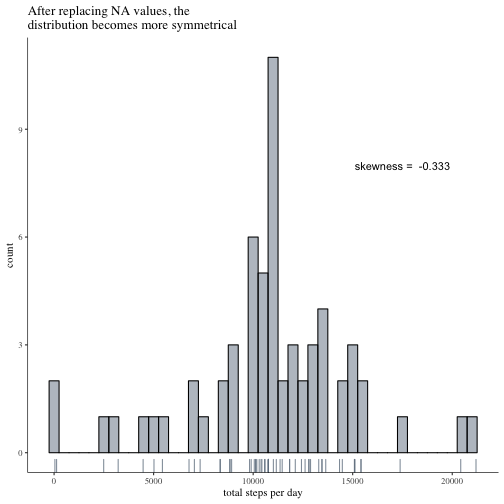
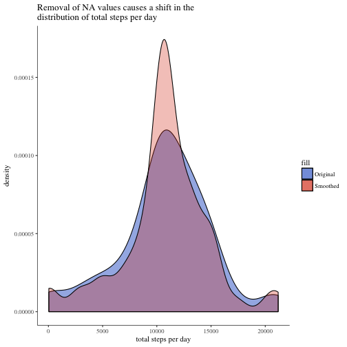
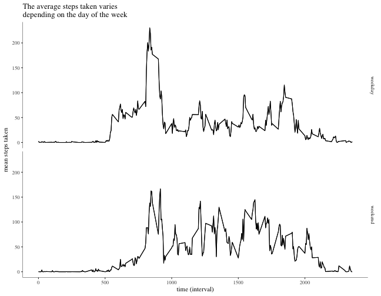

# Reproducible Research: Assignment 1
Andrew Fox

***
***
#### Assignment 1 (week 2) of the Reproducible Research course as part of the Johns Hopkins data science specialization on [Coursera](https://www.coursera.org/specializations/jhu-data-science)
***
The dataset for this analysis takes data that was collected from a personal activity tracker during October and November 2012.  All the data was collected from one anonymous individual.  The data contains information on the number of steps taken separated into 5 minute intervals.

For this analysis I will use the following libraries:

```r
library(tidyverse)      # For data manipulation
library(ggplot2)        # For data visualisation
library(ggthemes)       # For data visualisation 
library(moments)        # Statistical analysis
library(knitr)          # Formatting & tables
library(chron)          # Dates and Times
library(stringr)        # String manipulation
library(lubridate)      # Dates and Times
library(scales)         # Plotting date_time scales
```

***
The first step is to load the dataset in:


```r
activity <- read_csv('data/activity.csv')
```

We can then view information on the dimensions of the dataframe and summarise the data:


```r
dim(activity)
```

```
## [1] 17568     3
```

```r
summary(activity)
```

```
##      steps             date               interval     
##  Min.   :  0.00   Min.   :2012-10-01   Min.   :   0.0  
##  1st Qu.:  0.00   1st Qu.:2012-10-16   1st Qu.: 588.8  
##  Median :  0.00   Median :2012-10-31   Median :1177.5  
##  Mean   : 37.38   Mean   :2012-10-31   Mean   :1177.5  
##  3rd Qu.: 12.00   3rd Qu.:2012-11-15   3rd Qu.:1766.2  
##  Max.   :806.00   Max.   :2012-11-30   Max.   :2355.0  
##  NA's   :2304
```

From this we can see that there are 17568 observations and 3 variables.  Each observation equates to a single 5 minute window. The step variable is the number of steps taken in that window, the date is the day and the interval identifies the time of day the measurement was taken (in 24hr format).   We can also see from the summary that there are 2304 missing values from the steps variable.  This equates to 192 hours or 8 days of missing data, perhaps when the device wasn't being worn.  The fact that there are exactly 8 days worth of missing data makes me think that it is likely that there are whole days missing rather than periods of days.  I was going to look into this first however the structure of the assignment is quite clearly laid out and the part dealing with missing data comes later so to avoid repeating myself I will leave it until then.

***

### Question 1 - What is the mean number of steps taken per day?
#### Calculate the total number of steps taken per day:

In order to obtain the total number of steps taken each day I will group the data by the date variable and calculate the sum of the steps for each group:


```r
# Create summary dataframe grouping by date and totalling the steps
per_day <- activity %>%
        group_by(date) %>%
        summarise(total_steps = sum(steps))

head(per_day)
```

```
## # A tibble: 6 x 2
##         date total_steps
##       <date>       <int>
## 1 2012-10-01          NA
## 2 2012-10-02         126
## 3 2012-10-03       11352
## 4 2012-10-04       12116
## 5 2012-10-05       13294
## 6 2012-10-06       15420
```

#### Make a histogram of the total number of steps each day:
Below I construct a Histogram to show the distribution of the number of steps taken each day.  After some deliberation I have settled on a binwidth of 500 steps as I feel this gives the best amount of fidelity to the overall distribution without over-crowding the plot.  I have also calculated the skewness to provide some further insight. In this instance I have omitted kurtosis as the low sample size and high variablility will lead to heavy tails and the figure will not be of much use as a result.  As we can determine from the plot the distribution appears to be unimodal whilst the slightly negative skewness indicates a mild left skew, this seems to be supported in the plot by the few peaks observed in the 12500 - 15000 range.  Although it should be noted that this is only a relatively small sample of 53 days (61 total with 8 excluded due to containing missing data) and this should be considered when inferring any results.


```r
# Calculate the skewness
skew <- round(skewness(per_day$total_steps, na.rm = TRUE), 4)

# Plot histogram
ggplot(per_day, aes(total_steps)) +
        theme_tufte() +
        geom_histogram(binwidth = 500, 
                       fill = 'slategrey', alpha = 0.5, 
                       colour = 'black',
                       na.rm = TRUE) +
        theme(axis.line = element_line(colour = 'black', size = 0.3)) +
        labs(title = 'The distribution of total steps per day is unimodal\nwith a slight left skew',
             y = 'count',
             x = 'total steps per day') +
        annotate('text', x = 19000, y = 5.5,
                 label = paste('skewness = ', skew)) +
        geom_rug(colour = 'slategrey', alpha = 0.8)
```



***

*As a slight abstract around my plotting technique I frequently utilise the 'Tufte' theme from the ggthemes library.  This is based on the 'Data-Ink Maximization' ideas raised in Chapter 6 of the book 'The Visual Display of Quantitative Information' by Edward Tufte.  The main reason for using this is that it is a quick way to remove much of the aesthetic noise of the standard ggplot themes, I can then add in the elements such as axis lines and labels as I feel appropriate.*

***

#### Calculate and report the mean and median of the total steps taken per day:
This is fairly straightforward as I have already separated and grouped the data, I simply ran a summary on the total_steps variable to obtain the averages with the missing data omitted.

```r
summary(per_day$total_steps)
```

```
##    Min. 1st Qu.  Median    Mean 3rd Qu.    Max.    NA's 
##      41    8841   10765   10766   13294   21194       8
```
From this we can see that the **Mean value is 10766** and the **Median value is 10765**.

***

### Question 2: What is the average daily activity pattern?
#### Make a time-series plot of the 5-minute interval (x-axis) and the average number of steps taken, averaged across all the days (y-axis)

The first step to this part of the analysis is to group the data by the time interval and calculate the mean number of steps taken for each interval:

```r
time <- activity %>%
        group_by(interval) %>%
        summarise(mean_steps = mean(steps, na.rm = TRUE))
```

I wanted to find a way to convert the interval variable into times, mainly for my own knowledge and understanding.  This was not part of the assignment as it is asked for the x axis on the plot to be of the 5 minute intervals, however following some wrangling and string manipulation I devised the following code that seems to do the trick...

```r
# Convert the interval variable into times
# Add leading zeroes with string pad
time$interval <- str_pad(time$interval, 4, side = c('left'), pad = 0)
# Using gsub to insert a colon to separate hours and minutes
time$interval <- gsub("(\\d{2})(?=\\d{2})", "\\1:", time$interval, perl = TRUE)
# Add in an arbitrary date to allow for date_time series manipulation, add seconds after.
time <- time %>%
        mutate(date_time = paste('1990/01/01', interval)) %>%
        mutate(date_time = paste(date_time, ':00', sep = ''))
# Parse to date_time with lubridate package
time$date_time <- parse_date_time2(time$date_time, orders = 'Ymd HMS')
```

As you can see this was a fairly convoluted process and I am sure that there is probably a much better and cleaner way to achieve the same thing.  I also think I may be over thinking the problem of the time_series scale (the plot can of course be made with no manipulation at all). The next stage is to construct the plot:


```r
ggplot(time, aes(x = date_time, y = mean_steps)) +
        theme_tufte() +
        theme(axis.line = element_line(colour = 'black', size = 0.2)) +
        geom_line() +
        scale_x_datetime(labels = date_format("%H:%M")) +
        labs(title = 'The number of steps taken varies\nthroughout the day',
             y = 'Mean number of steps taken',
             x = 'Time (24hr)')
```



#### Which 5-minute interval, on average across all the days in the dataset, contains the maximum number of steps?

To get this information we can simply return the row of the dataframe where the mean_steps variable is equal to the maximum value for that variable:

```r
time[time$mean_steps == max(time$mean_steps),]
```

```
## # A tibble: 1 x 3
##   interval mean_steps           date_time
##      <chr>      <dbl>              <dttm>
## 1    08:35   206.1698 1990-01-01 08:35:00
```
From this we are able to see that **interval 835 (08:35am) has the highest average step count at ~206**.

***

### Question 3: Inputting missing values
This is the part of the analysis I referenced at the beginning where I will deal with the missing values in the data:

#### Calculate and report the total number of missing values in the dataset (i.e. the total number of rows with NA)

As was shown at the start of this analysis the total number of missing values in the dataset is **2304**:

```r
sum(is.na(activity))
```

```
## [1] 2304
```

All of this missing data is concentrated in the steps variable, there is no missing data in the date or interval columns:

```r
summary(activity)
```

```
##      steps             date               interval     
##  Min.   :  0.00   Min.   :2012-10-01   Min.   :   0.0  
##  1st Qu.:  0.00   1st Qu.:2012-10-16   1st Qu.: 588.8  
##  Median :  0.00   Median :2012-10-31   Median :1177.5  
##  Mean   : 37.38   Mean   :2012-10-31   Mean   :1177.5  
##  3rd Qu.: 12.00   3rd Qu.:2012-11-15   3rd Qu.:1766.2  
##  Max.   :806.00   Max.   :2012-11-30   Max.   :2355.0  
##  NA's   :2304
```

Some basic maths shows us that the number of 5 minute intervals missing from the data equates to exactly 8 days (there are 288 intervals of 5 minutes in 24 hours):


```r
sum(is.na(activity)) / 288
```

```
## [1] 8
```

This leads me to believe that it is possible that the missing data relates to entire days rather than sub-sets of days.  If this is the case then there should be 8 unique dates each with 288 missing observations:


```r
activity %>%
        filter(is.na(steps)) %>%
        group_by(date) %>%
        summarise(missing_obs = n())
```

```
## # A tibble: 8 x 2
##         date missing_obs
##       <date>       <int>
## 1 2012-10-01         288
## 2 2012-10-08         288
## 3 2012-11-01         288
## 4 2012-11-04         288
## 5 2012-11-09         288
## 6 2012-11-10         288
## 7 2012-11-14         288
## 8 2012-11-30         288
```

#### Devise a strategy for filling in all of the missing values in the dataset.
There are a number of possible stategies for dealing with this missing data, some far more complex than others.  The question in the assignment stresses that you do not need to find an overly complicated solution to the problem and so I settled on using the average step data for each interval as this had already been defined in a previous question and would provide a good compromise between complicated statistical modelling and overly simplifying the data. To achieve this I have added a second column with the average steps for each interval and then used an if/else statement to replace the NA values in the steps column with the values in the new column. This method takes advantage of the fact that the number of intervals in each day is constant and that the missing data is always across whole days.  Looking at the code I think it may be fairly inefficient however due to the small size of the dataset this is not really an issue.  If there were many more observations I would look for a more processor efficient solution but this works just fine for this purpose.

#### Create a new dataset with the NA values filled in:


```r
# Create a new dataset, I would normally just add to the original but the assignment specifies to create a new set
activity_2 <- activity

# Add average steps column, repeating the daily average values for each day observed
activity_2 <- activity_2 %>%
                mutate(steps2 = rep(time$mean_steps, 61))

# Replace any NA values in the steps variable with the equivalent average value from the new column
activity_2$steps <- ifelse(!is.na(activity_2$steps), activity_2$steps, activity_2$steps2)

# Drop the average column (purely for housekeeping purposes as it will no longer be used)
activity_2 <- select(activity_2, -steps2)
```

For the purposes of evaluating the output of this it is quite useful that in the original data the first day of observation (1st October) has missing values.  We can therefore gain assurance that it has worked by simply viewing the head of the data and seeing if there are step values in place:

```r
head(activity_2)
```

```
## # A tibble: 6 x 3
##       steps       date interval
##       <dbl>     <date>    <int>
## 1 1.7169811 2012-10-01        0
## 2 0.3396226 2012-10-01        5
## 3 0.1320755 2012-10-01       10
## 4 0.1509434 2012-10-01       15
## 5 0.0754717 2012-10-01       20
## 6 2.0943396 2012-10-01       25
```

We can also check that there are no longer any NA values in the dataset:

```r
sum(is.na(activity_2))
```

```
## [1] 0
```

#### Make a histogram of the total number of steps taken each day:
For consistency I will use the same method and histogram I created previously just changing the input data to the new dataframe:


```r
# Create summary dataframe grouping by date and totalling the steps
per_day_2 <- activity_2 %>%
                group_by(date) %>%
                summarise(total_steps = sum(steps))

# Calculate the sknewness
skew_2 <- round(skewness(per_day_2$total_steps, na.rm = TRUE), 4)

# Plot histogram
ggplot(per_day_2, aes(total_steps)) +
        theme_tufte() +
        geom_histogram(binwidth = 500, 
                       fill = 'slategrey', alpha = 0.5, 
                       colour = 'black',
                       na.rm = TRUE) +
        theme(axis.line = element_line(colour = 'black', size = 0.3)) +
        labs(title = 'After replacing NA values, the\ndistribution becomes more symmetrical',
             y = 'count',
             x = 'total steps per day') +
        annotate('text', x = 17500, y = 8,
                 label = paste('skewness = ', skew_2)) +
        geom_rug(colour = 'slategrey', alpha = 0.8)
```



Here we see that the distribution has become more symmetrical with the inclusion of the average values in place of the NAs, this is to be expected.  There is a slight increase in the skewness probably due to the extreme values on some days and the low sample size, I would have expected this to move closer to zero.  It still sits well within the expected range for a symmetrical distribution and so I am not dwelling too much on it at this stage.  Futher investigations into the distribution may require a look into the change in this value.

#### Calculate and report the mean and median total number of steps taken per day:

This is a fairly simple calculation:

```r
# Assign one to a variable to allow it to be referenced in the text below...
summary(per_day_2$total_steps)
```

```
##    Min. 1st Qu.  Median    Mean 3rd Qu.    Max. 
##      41    9819   10766   10766   12811   21194
```

From this output we can see that the mean and median values are identical, this is indicative of a symmetrical distribution as we observed in the histogram above.

It is also a slight variation from the original values:

```r
summary(per_day$total_steps)
```

```
##    Min. 1st Qu.  Median    Mean 3rd Qu.    Max.    NA's 
##      41    8841   10765   10766   13294   21194       8
```
Where there was a slight difference between the mean and median values.

This change in distributions can be seen quite clearly by contructing a quick density plot of the total step variables:


```r
ggplot() +
        theme_tufte() +
        scale_fill_gdocs() +
        geom_density(data = per_day, aes(x = total_steps, y = ..density.., fill = 'Original'),
                     alpha = 0.5, na.rm = TRUE) +
        geom_density(data = per_day_2, aes(x = total_steps, y = ..density.., fill = 'Smoothed'),
                     alpha = 0.3) +
        theme(axis.line = element_line(colour = 'black', size = 0.3)) +
        labs(title = 'Removal of NA values causes a shift in the\ndistribution of total steps per day',
             y = 'density',
             x = 'total steps per day')
```



The smoothed data has a far higher density around the median value which is to be expected as average values were used to populated the missing data.

***

### Question 4: Are there differences in activity patterns between weekdays and weekends?

This part of the analysis will look into whether there are differences in the activity patterns between weekdays and weekends.

#### Create a new factor variable in the dataset with two levels – “weekday” and “weekend” indicating whether a given date is a weekday or weekend day.

In order to complete this I am using the `is.weekend()` function from the `chron` package (available on CRAN).  This takes a vector of dates and returns boolean values indicating whether or not that date fell on a weekend.  I could then use this to create a factor variable with more decriptive labels:

```r
activity_2 <- activity_2 %>%
                        mutate(day = as.factor(if_else(is.weekend(date), 'weekend', 'weekday')))
head(activity_2)
```

```
## # A tibble: 6 x 4
##       steps       date interval     day
##       <dbl>     <date>    <int>  <fctr>
## 1 1.7169811 2012-10-01        0 weekday
## 2 0.3396226 2012-10-01        5 weekday
## 3 0.1320755 2012-10-01       10 weekday
## 4 0.1509434 2012-10-01       15 weekday
## 5 0.0754717 2012-10-01       20 weekday
## 6 2.0943396 2012-10-01       25 weekday
```

```r
table(activity_2$day)
```

```
## 
## weekday weekend 
##   12960    4608
```

As we can see, 12960 observations fell on weekdays and 4608 on weekends. This equates to 45 weekdays and 16 weekend days in the dataset.  This seems reasonable as it equates to 9 weeks of weekdays and 8 weekends.  Considering the data starts on a Monday (01/10/2012), I am confident that this is accurate.

We can then group the dataset by the interval and the weekday factor variables and produce a plot comparing the 2 using `ggplot2`'s inbuilt `facet_grid` function. For this plot I have left the intervals (x-axis) as-is rather than applying the coversion method I described earlier in the analysis.


```r
# Create average steps across each interval
weekday <- activity_2 %>%
                        group_by(interval, day) %>%
                        summarise(av_steps = mean(steps))

# Create average steps across each interval
weekday <- activity_2 %>%
                        group_by(interval, day) %>%
                        summarise(av_steps = mean(steps))
# Plot chart
ggplot(weekday, aes(interval, av_steps)) +
        geom_line() +
        facet_grid(day ~ .) +
        theme_tufte() +
        theme(axis.line = element_line(colour = 'black', size = 0.2)) +
        geom_line() +
        labs(title = 'The average steps taken varies\ndepending on the day of the week',
             x = 'time (interval)',
             y = 'mean steps taken')
```



This plot shows that there is little variation between the pattern of steps taken during weekdays and at weekends.  There is a peak at around 8pm on weekends that is not present in the weekday sample indicating that the subject may be more active on weekend evenings than at the same time on weekdays. The most noticable difference however is in the mornings where weekdays see an increase in activity at around 5am not present in the weekend data, indicating to me that it is likely our subject is having a well-deserved lie in on the weekend!
